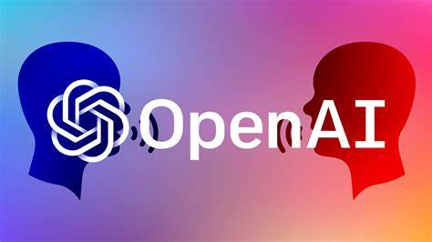

---

# 🤖 OpenAI Chatbot Project

**Welcome to the **OpenAI Chatbot** project! This chatbot leverages OpenAI's language models to create an interactive conversational assistant that can handle a wide range of queries, from casual conversation to technical support. Built using Python, this project demonstrates how to integrate OpenAI's API to create powerful chat experiences.**

---
## 🌟 Features
- **Conversational AI**: Supports natural, dynamic conversation flows.
- **Customizable Settings**: Control parameters like response length, temperature, and more.
- **Easy Setup**: Simple installation and configuration for rapid deployment.
- **Extensible**: Built with a modular design, allowing easy customization and feature addition.

  ---
## 📸 AI

  
*Experience how it work!*

## 🚀 Getting Started
---
### Prerequisites
- **Python 3.8+**: Ensure you have Python installed on your machine.
- **OpenAI API Key**: Sign up at [OpenAI](https://platform.openai.com/) and retrieve your API key.
---
### Installation

1. **Clone the Repository**:
   ```bash
   git clone https://github.com/chrohangurjar1/OpenAI-Chatbot.git
   cd OpenAI-Chatbot
   ```

2. **Set Up Virtual Environment**:
   ```bash
   python -m venv .venv
   source .venv/bin/activate  # On Windows use: .venv\Scripts\activate
   ```

3. **Install Dependencies**:
   ```bash
   pip install -r requirements.txt
   ```

4. **Add Your OpenAI API Key**:
   - Create a `.env` file and add your API key:
     ```plaintext
     OPENAI_API_KEY=your_openai_api_key_here
     ```
---
### Usage
Run the chatbot by executing:
```bash
python main.py
```
Interact with the chatbot in your terminal! Type "exit" to end the session.
---
## 🛠️ Project Structure
```
├── main.py                 # Main chatbot script
├── README.md               # Project documentation
├── requirements.txt        # Python dependencies
├── .env                    # API key configuration
└── .venv                   # Virtual environment
```
---
## ⚙️ Configuration Options
You can customize the bot's behavior by adjusting parameters in `main.py`:
- **Model**: Choose between available models like `gpt-3.5-turbo` or `gpt-4`.
- **Max Tokens**: Set the response length for chatbot replies.
- **Temperature**: Adjust response randomness (0 for deterministic, 1 for more creative).
---
## 🤖 Example Interaction
```
Chatbot: Hello! Ask me anything. Type 'exit' to end the chat.
You: What is the capital of France?
Chatbot: The capital of France is Paris.
```
---
## 📈 Future Features
- **Interactive Web Interface**: Build a front-end using Flask or React.
- **Language Support**: Enable support for multiple languages.
- **Persistent Memory**: Store chat history for continuous conversations.
---
## 🧑‍🤝‍🧑 Contributors
- **Your Name** - Project Creator
- **Collaborator Names** - Additional contributors
---
## 📄 License
This project is licensed under the MIT License. See the [LICENSE](LICENSE) file for details.
---
## 💡 Acknowledgements
- **OpenAI**: For their powerful APIs and support for AI research.
- **Python Community**: For making coding accessible and fun.
---
## 🌟 Contributors

We want to give a huge shoutout to everyone who has contributed to the project! 🙌 Your hard work and dedication help make this app better every day. 💪

<a href="https://github.com/chrohangurjar1/RustWeatherApp/graphs/contributors">
  
</a>

🎉 Thank you all for your amazing contributions! Let's keep building together. 🚀
---
## 🌐 Connect with Us
Follow us on:
- **Twitter**: [@Rohan Naagar](https://twitter.com/yourhandle)
- **LinkedIn**: [Rohan Naagar]((https://www.linkedin.com/in/rohan-naagar-779310322/?lipi=urn%3Ali%3Apage%3Ad_flagship3_feed%3BDbpHFgJ3T4mafZrBEG1aQA%3D%3D)](https://www.linkedin.com/in/rohan-naagar-779310322/))

---
